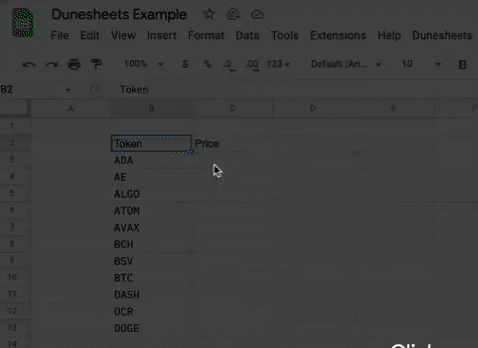

# DuneSheets

DuneSheets is a Google Add-On that allows anyone to fetch any Dune data directly into their Google Sheets.

Built with ❤️ at ETHBerlin³ by @zkguardian and @0xyielddaddy - 🚀 [http://www.dunesheets.com/](http://www.dunesheets.com/)

## Add DuneSheets to your spreadsheet

1. Create or open a spreadsheet in Google Sheets.
2. Select the menu item > Extensions > Apps Script
3. Copy and paste the 'DuneSheets.gs'
4. Replace the API_KEY value with your API Key
5. Enjoy the Dune functions in your spreadsheet

## Receive your own API Key

- **Get a Dune API Key**
    - Start [here](https://dune.com/docs/api/eth-ber/)
    - For API keys, email [api@dune.com](mailto:api@dune.com) or find the Dune team IRL
    - Dune has a dedicated support channel in their [Discord](https://discord.gg/ErrzwBz) at [#dune-api](https://discord.com/channels/757637422384283659/973606737393352745)

## Info!

The DuneSheets Add-On is currently unlisted. We expect to have it released by the beginning of October 2022.
